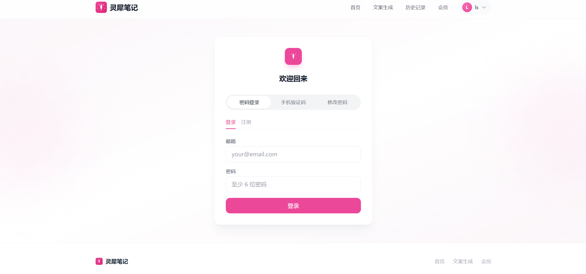
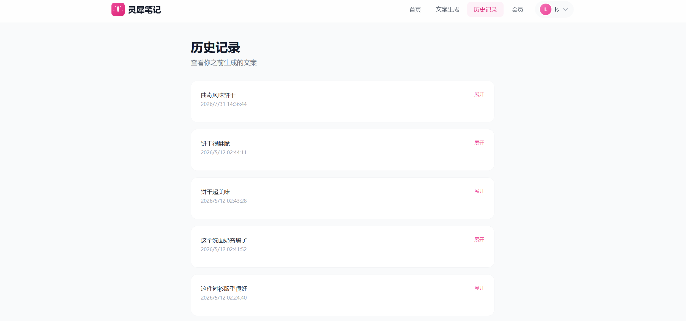

# 小红书爆款文案生成器 📕

> AI 驱动的智能文案生成工具，一键生成小红书爆款内容。

🌐 **线上前端页面**: [http://lingxinote.top](http://lingxinote.top)（在浏览器打开这个）

📡 **API 接口**: `http://lingxinote.top/api`（前端调用；浏览器直接打开 `http://lingxinote.top/api/health` 会返回 JSON 状态）

🔗 **备用地址**: `http://47.86.227.167`

## 📸 产品截图

| | |
|---|---|
|  |  |
|  |  |
|  |  |

## ✨ 功能

- **🔥 爆款标题生成** — 自动生成 10 个吸引人的小红书风格标题
- **💭 情绪化开头** — 创作极具感染力的开头段落
- **🔄 去 AI 味改写** — 让文案像真人自然表达
- **😊 Emoji 智能添加** — 在恰当位置加入热门 emoji
- **🌱 种草风格转换** — 一键转换为小红书种草文案
- **⚡ 流式输出** — AI 实时生成，无需漫长等待

## 🏗 技术栈

| 层级 | 技术 |
|------|------|
| 前端 | Next.js 15 + TypeScript + TailwindCSS |
| 后端 | FastAPI + SQLAlchemy + SQLite |
| 认证 | JWT (python-jose + bcrypt) |
| AI | DeepSeek API (deepseek-chat) |
| 支付 | Stripe (预留) |

## 📁 项目结构

```
xhs/
├── frontend/           # Next.js 前端
│   ├── src/
│   │   ├── app/        # 页面 (5 个路由)
│   │   ├── components/ # UI 组件
│   │   ├── lib/        # API 调用 & 工具
│   │   └── types/      # TypeScript 类型
│   ├── package.json
│   └── next.config.js
├── backend/            # FastAPI 后端
│   ├── app/
│   │   ├── routers/    # API 路由 (auth, generate, user)
│   │   ├── services/   # AI & 支付服务
│   │   ├── models/     # ORM 模型
│   │   └── schemas/    # Pydantic 请求/响应
│   ├── prompts/        # 可配置 Prompt 模板
│   ├── requirements.txt
│   └── init_db.py      # 数据库初始化
├── deploy.sh           # Ubuntu + Nginx 部署脚本
└── README.md
```

## 🚀 快速开始（本地开发）

### 前置要求

- Python 3.10+
- Node.js 18+
- Redis（手机验证码功能必需）
- DeepSeek API Key（或 OpenAI 兼容接口）

### 1. 后端启动

```bash
cd backend
cp .env.example .env    # 编辑 .env 填入 API Key
pip install -r requirements.txt
python init_db.py        # 初始化数据库
uvicorn app.main:app --reload --port 8000
```

本地 API 文档: http://localhost:8000/docs

### 2. 前端启动

```bash
cd frontend
cp .env.local.example .env.local  # 本地开发用 http://localhost:8000
npm install
npm run dev
```

本地访问: http://localhost:3000

### 3. 使用流程（线下 / 线上通用）

1. 打开页面 → 点击"免费注册"
2. 输入邮箱、用户名、密码 → 注册并自动登录
3. 进入"文案生成"页 → 输入文案 → 点击生成
4. 等待流式输出完成 → 复制结果
5. 在"历史记录"页查看所有生成记录

## 🌐 部署 (Ubuntu + Nginx)

### 生产环境

| 项目 | 信息 |
|------|------|
| 服务器 IP | `47.86.227.167` |
| 域名 | `lingxinote.top` |
| 项目路径 | `/opt/xhs-copywriter` |

```bash
# 将项目上传到服务器后运行
chmod +x deploy.sh
sudo bash deploy.sh
```

部署脚本自动完成：
1. 安装 Python/Node.js/Nginx
2. 配置后端虚拟环境 + systemd 服务
3. 构建前端 + systemd 服务
4. 配置 Nginx 反向代理
5. (可选) Let's Encrypt SSL

### 手动部署检查清单

部署前确认以下配置已完成：

- [ ] `backend/.env` — 已配置 `SECRET_KEY`、`OPENAI_API_KEY`、`REDIS_URL`
- [ ] `frontend/.env.local` — 已配置 `NEXT_PUBLIC_API_URL` 指向后端
- [ ] `deploy.sh` — `DOMAIN` 变量已设为实际域名
- [ ] Redis 服务已启动（手机验证码必需）
- [ ] 80 / 443 端口已开放（防火墙 / 安全组）

### 同步代码到服务器

> 同步脚本 `sync_to_server.sh` 为本地运维工具（包含服务器凭据），未纳入本仓库，请自行在本地维护。

## ⚙️ 环境变量

### 后端 (`backend/.env`)

| 变量 | 说明 | 默认值 |
|------|------|--------|
| `DATABASE_URL` | SQLite 数据库路径 | `sqlite:///./xhs.db` |
| `SECRET_KEY` | JWT 签名密钥 | `(必填)` |
| `ALGORITHM` | JWT 加密算法 | `HS256` |
| `ACCESS_TOKEN_EXPIRE_MINUTES` | 登录有效期（分钟） | `1440` |
| `OPENAI_API_KEY` | DeepSeek/兼容 API 密钥 | `(必填)` |
| `OPENAI_BASE_URL` | API 接口地址 | `https://api.deepseek.com/v1` |
| `OPENAI_MODEL` | 使用的模型 | `deepseek-chat` |
| `REDIS_URL` | Redis 连接地址 | `redis://localhost:6379/0` |
| `DAILY_FREE_LIMIT` | 免费用户每日调用次数 | `3` |
| `PREMIUM_DAILY_LIMIT` | 付费用户每日调用次数 | `999` |
| `FRONTEND_URL` | 前端地址（CORS用） | `http://localhost:3000` |
| `SMS_ENABLED` | 是否启用真实验证码 | `false` |
| `SMS_ACCESS_KEY` | 阿里云 AccessKey | `(可选)` |
| `SMS_SECRET_KEY` | 阿里云 SecretKey | `(可选)` |
| `STRIPE_SECRET_KEY` | Stripe 密钥 | `(可选)` |
| `STRIPE_WEBHOOK_SECRET` | Stripe Webhook 密钥 | `(可选)` |

### 前端 (`frontend/.env.local`)

| 变量 | 说明 | 示例 |
|------|------|------|
| `NEXT_PUBLIC_API_URL` | 后端地址（不要带 `/api` 后缀，代码会自动拼接） | `http://lingxinote.top` |

## ❓ 常见问题

<details>
<summary><b>前端页面访问不了</b></summary>

确认 Nginx 和前端服务都在运行：
```bash
systemctl status nginx
systemctl status xhs-frontend
```
</details>

<details>
<summary><b>API 请求报 CORS 错误</b></summary>

检查 `backend/app/main.py` 中 `allow_origins` 是否包含你的前端域名，以及环境变量 `FRONTEND_URL` 是否正确。
</details>

<details>
<summary><b>手机验证码收不到 / 显示发送失败</b></summary>

检查 Redis 是否运行：`redis-cli ping`
- 本地开发：确认 `SMS_ENABLED=false`（使用固定码 `000000`）
- 生产环境：确认 `SMS_ENABLED=true` 且已配置阿里云 AccessKey
</details>

<details>
<summary><b>注册 / 登录报 500 错误</b></summary>

通常是数据库未初始化，运行：`cd backend && python init_db.py`
</details>

---

## 📝 Prompt 模板

prompts/ 目录下的 txt 文件是 AI 提示词模板，支持 `{input_text}` 占位符:

- `titles.txt` — 标题生成
- `opening.txt` — 情绪化开头
- `deai.txt` — 去 AI 味
- `emoji.txt` — Emoji 添加
- `zhongcao.txt` — 种草风格

可直接编辑这些文件修改 AI 行为，重启后生效。

## 📄 License

MIT
